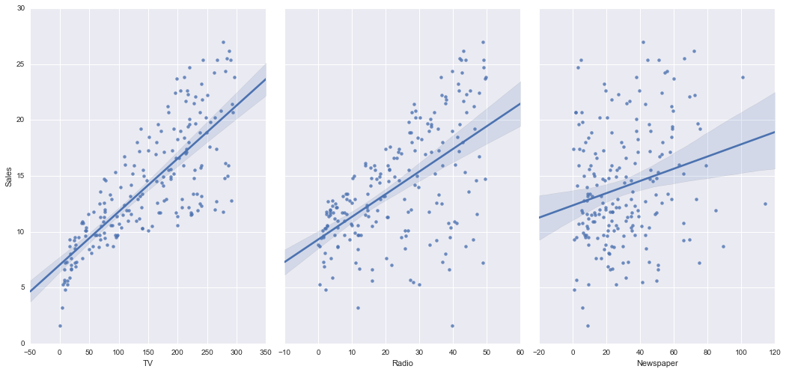
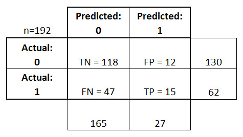
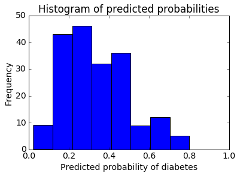
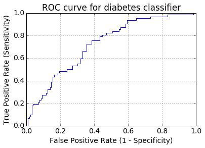

# scikit


- KNN sample
```python
from sklearn.neighbors import KNeighborsClassifier

knn = KNeighborsClassifier(n_neighbors=5)
knn.fit(X, y)
knn.predict([[3, 5, 4, 2]])
```

- logistic regressioin sample
```python
from sklearn.linear_model import LogisticRegression

logreg = LogisticRegression()
logreg.fit(X, y)
logreg.predict(X_test)
print(linreg.intercept_)
print(linreg.coef_)
```

- pair the feature names with the coefficients:
```python
list(zip(feature_cols, linreg.coef_))
```

- accuracy measurement
```python
from sklearn import metrics
import numpy as np

print(metrics.accuracy_score(y, y_pred))
print(metrics.mean_absolute_error(true, pred))
print(metrics.mean_squared_error(true, pred))

# calculate RMSE
print(np.sqrt(metrics.mean_squared_error(y_test, y_pred)))
```

- train/test separation
```python
from sklearn.cross_validation import train_test_split

X_train, X_test, y_train, y_test = train_test_split(X, y, test_size=0.4, random_state=4)
```

- to find best K in KNN
```python
k_range = list(range(1, 26))
scores = []
for k in k_range:
    knn = KNeighborsClassifier(n_neighbors=k)
    knn.fit(X_train, y_train)
    y_pred = knn.predict(X_test)
    scores.append(metrics.accuracy_score(y_test, y_pred))
```

- scatterplot
```python
import pandas as pd
import seaborn as sns
%matplotlib inline

sns.pairplot(data, x_vars=['TV','Radio','Newspaper'], y_vars='Sales', size=7, aspect=0.7, kind='reg')
```


```python
X = data[['TV', 'Radio', 'Newspaper']]

# select a Series from the DataFrame
y = data['Sales']
# equivalent command that works if there are no spaces in the column name
y = data.Sales
```

- cross validation & search for an optimal value of K for KNN
```python
from sklearn.cross_validation import cross_val_score

k_range = list(range(1, 31))
k_scores = []
for k in k_range:
    knn = KNeighborsClassifier(n_neighbors=k)
    scores = cross_val_score(knn, X, y, cv=10, scoring='accuracy')
    k_scores.append(scores.mean())
print(k_scores)
```

- 10-fold cross-validation with two features
```python
feature_cols = ['TV', 'Radio']
X = data[feature_cols]
print(np.sqrt(-cross_val_score(lm, X, y, cv=10, scoring='mean_squared_error')).mean())
```

- GridSearchCV to get rid of for loop
```python
from sklearn.grid_search import GridSearchCV

k_range = list(range(1, 31))
param_grid = dict(n_neighbors=k_range)
grid = GridSearchCV(knn, param_grid, cv=10, scoring='accuracy')
grid.fit(X, y)

print(grid.grid_scores_)

print(grid.grid_scores_[0].parameters)
print(grid.grid_scores_[0].cv_validation_scores)
print(grid.grid_scores_[0].mean_validation_score)

print(grid.best_score_)
print(grid.best_params_)
print(grid.best_estimator_)
```

- GridSearchCV with two parameters
```python
k_range = list(range(1, 31))
weight_options = ['uniform', 'distance']

param_grid = dict(n_neighbors=k_range, weights=weight_options)
grid = GridSearchCV(knn, param_grid, cv=10, scoring='accuracy')
grid.fit(X, y)
```

- RandomizedSearchCV: Optimized way of doing `GridSearchCV`
```python
from sklearn.grid_search import RandomizedSearchCV

param_dist = dict(n_neighbors=k_range, weights=weight_options)
rand = RandomizedSearchCV(knn, param_dist, cv=10, scoring='accuracy', n_iter=10, random_state=5)
rand.fit(X, y)

rand.grid_scores_

print(rand.best_score_)
print(rand.best_params_)
```

- draw confusion matrix
```python
print(metrics.confusion_matrix(y_test, y_pred_class))
```


- Classification Accuracy: Overall, how often is the classifier correct?
```python
print((TP + TN) / float(TP + TN + FP + FN))
print(metrics.accuracy_score(y_test, y_pred_class))
```

- Classification Error: Overall, how often is the classifier incorrect?
```python
print((FP + FN) / float(TP + TN + FP + FN))
print(1 - metrics.accuracy_score(y_test, y_pred_class))
```

- Sensitivity: When the actual value is positive, how often is the prediction correct?
- How "sensitive" is the classifier to detecting positive instances? Also known as "True Positive Rate" or "Recall"
```python
print(TP / float(TP + FN))
print(metrics.recall_score(y_test, y_pred_class))
```

- Specificity: When the actual value is negative, how often is the prediction correct?
- How "specific" (or "selective") is the classifier in predicting positive instances?
```python
print(TN / float(TN + FP))
```

- False Positive Rate: When the actual value is negative, how often is the prediction incorrect?
```python
print(FP / float(TN + FP))
```

- Precision: When a positive value is predicted, how often is the prediction correct?
- How "precise" is the classifier when predicting positive instances?
```python
print(TP / float(TP + FP))
print(metrics.precision_score(y_test, y_pred_class))
```

- histogram of predicted probabilities
```python
%matplotlib inline
import matplotlib.pyplot as plt
plt.rcParams['font.size'] = 14

plt.hist(y_pred_prob, bins=8)
plt.xlim(0, 1)
plt.title('Histogram of predicted probabilities')
plt.xlabel('Predicted probability of diabetes')
plt.ylabel('Frequency')
```


- binarize based on given threshold
```python
from sklearn.preprocessing import binarize
y_pred_class = binarize([y_pred_prob], 0.3)[0]
```

- ROC Curves and Area Under the Curve (AUC)
```python
fpr, tpr, thresholds = metrics.roc_curve(y_test, y_pred_prob)

plt.plot(fpr, tpr)
plt.xlim([0.0, 1.0])
plt.ylim([0.0, 1.0])
plt.title('ROC curve for diabetes classifier')
plt.xlabel('False Positive Rate (1 - Specificity)')
plt.ylabel('True Positive Rate (Sensitivity)')
plt.grid(True)

```

- define a function to accept a threshold and print sensitivity and specificity
```python
def evaluate_threshold(threshold):
    print('Sensitivity:', tpr[thresholds > threshold][-1])
    print('Specificity:', 1 - fpr[thresholds > threshold][-1])

evaluate_threshold(0.5)
evaluate_threshold(0.3)
```

- AUC is the percentage of the ROC plot that is underneath the curve
```python
print(metrics.roc_auc_score(y_test, y_pred_prob))
```

# graphlab create
...